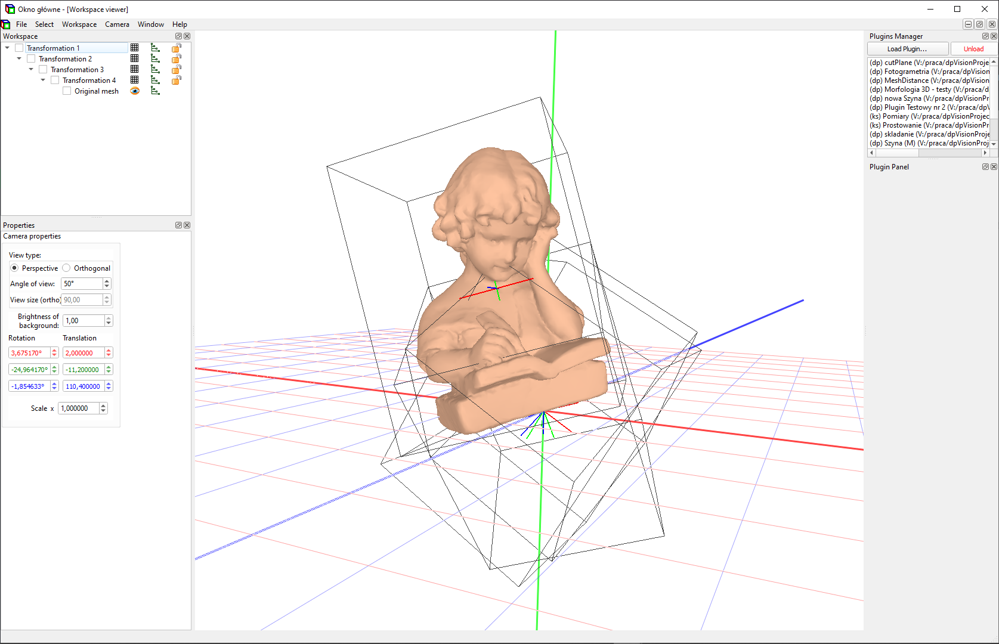

# dpVision
Experimental 3d viewer and editor

* The application currently compiles and runs only on Windows
* Easy CMake-based configuration
* Building with MinGW and MSVC++ was tested.

## prerequisites

* Qt5
* zlib if QtZlib is not found
* QuaZip
* boost
  * install boost package if your system can do it... (it is the fastest and most elegant way).
  * or alternatively download current release from <https://www.boost.org/> and unpack it to 3rdParty folder (it is fast too)
  * or alternatively (much slower but most recent sources) enter to 3rdParty folder and clone boost into it:
    * git clone --recurse-submodules <https://github.com/boostorg/boost>
  * if you choosed second or third way, enter the 3rdParty folder and execute two commands (change slash to backslash on Windows):
    * ./bootstrap
    * ./b2
* Eigen3

## Build with MinGW

* clone this repository

``git clone https://github.com/pojdulos/dpVision.git``

* go into project directory

``cd dpVision``

* create build folder and go into it

``mkdir build``

``cd build``

* configure project with CMake

``cmake  -G"Unix Makefiles" -D CMAKE_CXX_COMPILER=g++ -DCMAKE_BUILD_TYPE=Release ..``

* build project

``make``

* run dpVision application

``./dpVision.exe``

* optionaly create portable folder

``make bin``

